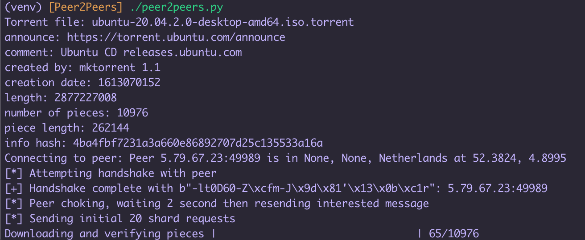

# Peer2Peers
A PoC of the tool discussed by [Peyton Engel](https://www.youtube.com/watch?v=7Obeod8X7Do).
Peer2Peers is a "torrent client" that supports IP geolocation and single source downloading of files. Included in the repo for testing
is an Ubuntu 20.04 torrent. This tool only works with single file torrents.
Expected output is included below. In practice, many peers will not share files or will
disconnect immediately. Once a peer that is willing to share pieces has been connected to,
all pieces will be downloaded over that TCP connection with no retry attempts. A more advanced
tool could reconnect and continue the download, but I have no intent to develop this tool beyond
"proof of concept" status.

